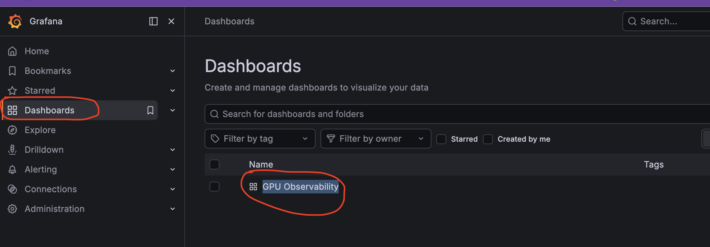
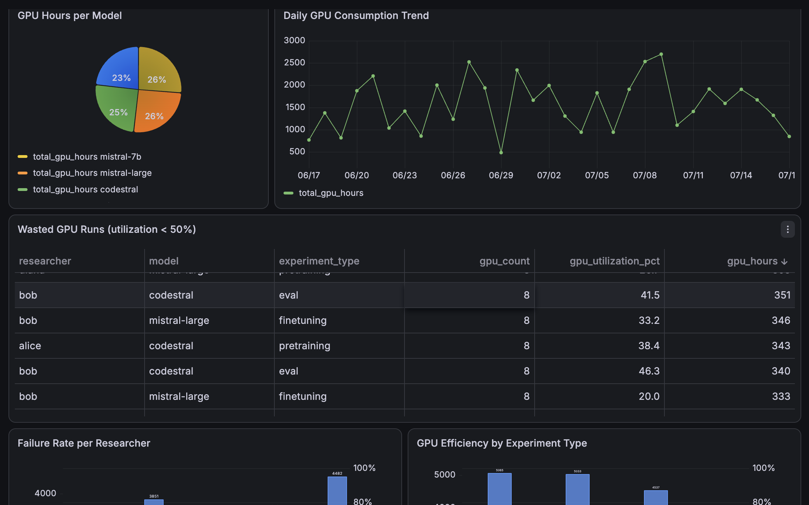

# gpu-observability

`gpu-observability` is a minimal end-to-end dashboard for exploring GPU usage in
a science organization. It simulates research workloads, analyzes them with
DuckDB, exposes the results through a Sanic API, and visualizes resource usage
and waste in Grafana.

The project is a prototype built around a practical question: **where did the
GPU compute budget go?** It helps identify heavy users and models, failed runs,
low-utilization workloads, and consumption trends without requiring a database
server or a real GPU cluster.

## How it works

```text
simulated runs.csv
       |
       v
DuckDB analytical queries
       |
       v
Sanic JSON API (:8000)
       |
       v
Grafana dashboard (:3000)
```

The Click command-line interface (CLI) generates and inspects the same CSV data
used by the API. DuckDB reads the file directly, so the project does not run a
persistent database service.

## Generated data schema

Each row in `data/runs.csv` represents one simulated GPU workload. The CSV acts
as the shared data contract between the CLI, DuckDB queries, Sanic API, and
Grafana dashboard.

| Column                   | Type     | Description                                                                                       |
| ------------------------ | -------- | ------------------------------------------------------------------------------------------------- |
| `run_id`               | Integer  | Sequential identifier for the generated run.                                                      |
| `researcher`           | String   | Researcher responsible for the run:`alice`, `bob`, `carlos`, `diana`, or `eve`.         |
| `model`                | String   | Model used by the workload:`mistral-7b`, `mistral-8x7b`, `mistral-large`, or `codestral`. |
| `experiment_type`      | String   | Workload category:`pretraining`, `finetuning`, `eval`, or `rlhf`.                         |
| `gpu_count`            | Integer  | Number of allocated GPUs:`1`, `2`, `4`, or `8`.                                           |
|  `gpu_utilization_pct` | Number   | Simulated average GPU utilization between 20% and 100%.                                           |
| `duration_hours`       | Number   | Simulated run duration between 0.5 and 48 hours.                                                  |
| `gpu_hours`            | Number   | Total compute consumed:`duration_hours × gpu_count`.                                           |
| `status`               | String   | Run outcome:`completed` or `failed`.                                                          |
| `start_time`           | Datetime | Simulated start time within the previous 30 days.                                                 |

The generator weights outcomes toward 75% completed runs and 25% failed runs.
All values are illustrative and do not represent real GPU telemetry.

## Project layout

```text
.
├── src/gpu_observability/
│   ├── api/main.py          # Sanic application and HTTP routes
│   ├── cli/                 # Click commands for data management
│   ├── core/
│   │   ├── generator.py     # Simulated research workload generator
│   │   └── queries.py       # Shared DuckDB reporting queries
│   └── config.py            # DATA_PATH configuration
├── grafana/
│   ├── dashboards/          # Provisioned dashboard definition
│   └── provisioning/        # Grafana data source and provider config
├── data/                    # Generated CSV data and exports
├── k8s/                     # Example Kubernetes manifests
├── tests/                   # Query tests using deterministic sample data
├── Dockerfile
├── docker-compose.yml
├── Makefile
├── pyproject.toml
└── uv.lock
```

## Prerequisites

For local development, install:

- Python 3.11 or later
- [uv](https://docs.astral.sh/uv/)
- Make

To run the complete API and Grafana stack, also install Docker with the Docker
Compose plugin.

## Quickstart with Docker Compose

This is the shortest path to the complete dashboard. The stack provisions the
Grafana data source and dashboard automatically.

```bash
make generate
make up
```

Open [Grafana at http://localhost:3000](http://localhost:3000) and sign in with:

- Username: `strong`
- Password: `wind`

Go to Dahsbord and click on GPU Observability



You will see a dashboard like that



The API is available at [http://localhost:8000](http://localhost:8000). Verify
it from another terminal:

```bash
curl http://localhost:8000/
curl http://localhost:8000/summary
```

The first request returns `{"status":"ok"}`. Stop both services with:

```bash
make down
```

## Run the API locally

Use this path when developing the generator, queries, CLI, or API without
Grafana.

1. Install the application and development dependencies:

   ```bash
   make install
   ```
2. Generate 500 simulated runs in `data/runs.csv`:

   ```bash
   make generate
   ```
3. Inspect the summary from the CLI:

   ```bash
   make show
   ```
4. Start the API:

   ```bash
   make serve
   ```
5. Open [http://localhost:8000/summary](http://localhost:8000/summary), or query
   it from a second terminal:

   ```bash
   curl http://localhost:8000/summary
   ```

Set `DATA_PATH` to read a different CSV file:

```bash
DATA_PATH=/absolute/path/to/runs.csv make serve
```

## CLI commands

The `gpu-obs` CLI supports data generation, reporting, and export.

```bash
uv run gpu-obs --help
uv run gpu-obs info
uv run gpu-obs data generate --rows 1000
uv run gpu-obs data generate --rows 1000 --path data/custom-runs.csv
uv run gpu-obs data show
uv run gpu-obs data export --format json
uv run gpu-obs data export --format csv --output data/export.csv
```

Generation replaces the target CSV with a new random dataset. The default
export path is `data/runs-export.json` or `data/runs-export.csv`.

## Make commands

| Command                 | Purpose                                                                                                   |
| ----------------------- | --------------------------------------------------------------------------------------------------------- |
| `make install`        | Install the application and development dependencies from`uv.lock`.                                     |
| `make install-prod`   | Install runtime dependencies without the development group.                                               |
| `make generate`       | Generate 500 simulated runs in the configured data file.                                                  |
| `make show`           | Print GPU usage grouped by researcher.                                                                    |
| `make serve`          | Start the Sanic API on port`8000`.                                                                      |
| `make up`             | Build and start the API and Grafana with Docker Compose.                                                  |
| `make down`           | Stop and remove the Compose services.                                                                     |
| `make build-docker`   | Build the`gpu-observability:latest` image.                                                              |
| `make dev-k3d-import` | Build the image and import it into the`strongwind` k3d cluster. Set `K3DNAME` to use another cluster. |
| `make test`           | Run the pytest suite.                                                                                     |
| `make lint`           | Check`src/` with Ruff.                                                                                  |
| `make format`         | Format`src/` with Ruff.                                                                                 |
| `make clean-cache`    | Remove Python, pytest, and Ruff caches.                                                                   |
| `make clean`          | Remove caches and the generated`data/runs.csv` file.                                                    |

## API endpoints

All endpoints accept `GET` requests and return JSON. The reporting endpoints
return `404 Not Found` when the configured CSV file does not exist.

| Endpoint           | Description                                                                    |
| ------------------ | ------------------------------------------------------------------------------ |
| `/`              | Return the API health status.                                                  |
| `/summary`       | Aggregate run count, GPU hours, utilization, and failures by researcher.       |
| `/waste`         | List individual runs with less than 50% GPU utilization, ordered by GPU hours. |
| `/by-model`      | Aggregate run count, GPU hours, and utilization by model.                      |
| `/trend`         | Aggregate GPU hours and run count by day.                                      |
| `/failure-rate`  | Calculate failure rate and estimated wasted GPU hours by researcher.           |
| `/by-experiment` | Compare utilization, consumption, and estimated waste by experiment type.      |

The API allows cross-origin `GET` and `OPTIONS` requests so that Grafana can
query it during local development.

## Dashboard panels

The provisioned **GPU Observability** dashboard contains seven panels:

1. **GPU Hours per Researcher** shows who consumes the most compute.
2. **Failed Runs per Researcher** compares unsuccessful allocations.
3. **GPU Hours per Model** shows where model investment is concentrated.
4. **Daily GPU Consumption Trend** supports anomaly detection and capacity review.
5. **Wasted GPU Runs** lists runs below 50% utilization and highlights severity.
6. **Failure Rate per Researcher** compares failed runs and estimated wasted hours.
7. **GPU Efficiency by Experiment Type** compares average utilization and waste
   across pretraining, finetuning, evaluation, and RLHF workloads.

## Stack decisions

- **CSV** keeps generated data portable and inspectable.
- **DuckDB** runs analytical SQL directly over the CSV without a separate
  database server.
- **Sanic** provides a small asynchronous JSON layer between the queries and
  dashboard.
- **Grafana** provides operational visualizations from a dashboard definition
  and data source stored in the repository.
- **Click** keeps generation, inspection, and export workflows available from a
  composable CLI.
- **uv** locks dependencies and provides reproducible local and container
  environments.

The `core` package contains generation and query logic with no CLI or HTTP
dependencies. Both Click and Sanic call this shared layer, which keeps delivery
code thin and makes the queries testable in isolation.

## Prototype scope

This project uses simulated data. It does not include authentication, alerting,
real GPU telemetry ingestion, or a production time-series database. A production
version would typically ingest metrics from tools such as NVIDIA DCGM Exporter,
enforce access control, persist data in a scalable analytical store, and add
alerting and environment-specific deployment configuration.
